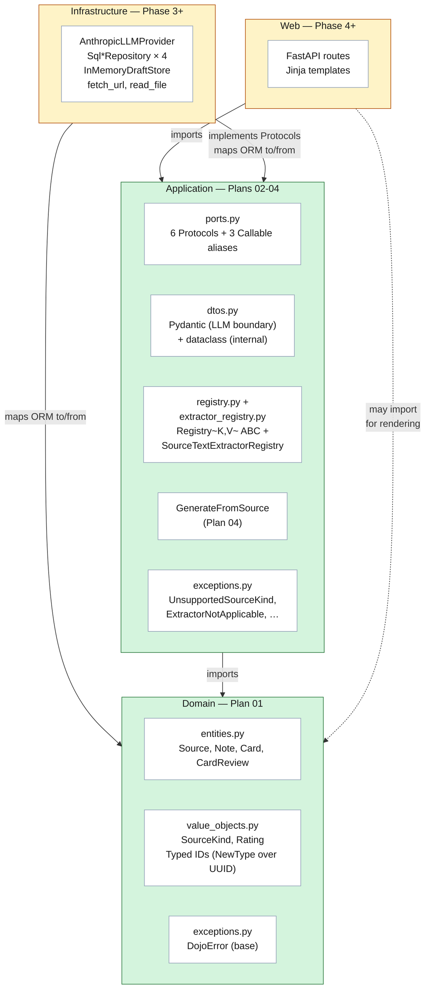
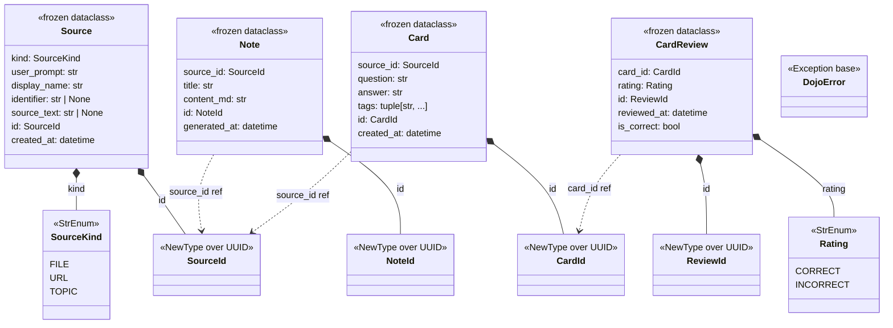
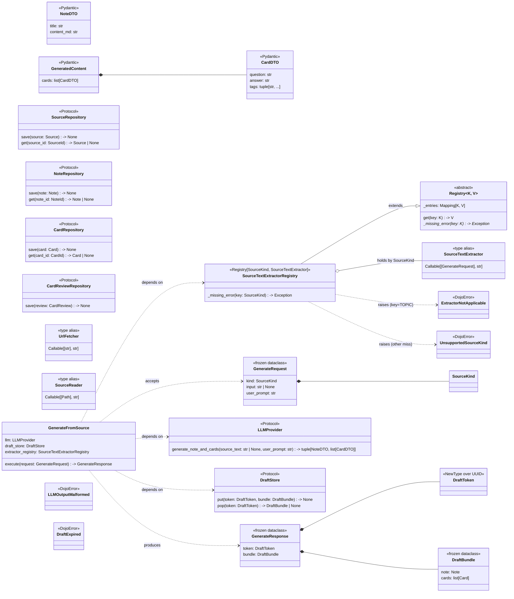
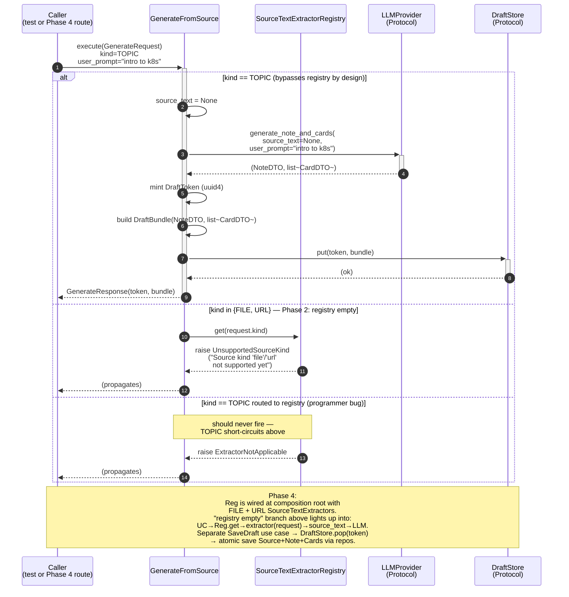

# Dojo v1 — Architecture Overview

**Last updated:** 2026-04-23
**Snapshot point:** Phase 2 (Plans 01–04 locked; Plan 05 pending)
**Scope:** Full v1 architecture. Locked layers rendered green; pending
layers (Phase 3 infrastructure, Phase 4+ web) rendered yellow.

This document is a **living v1 architecture overview**, updated as
each phase lands. It consolidates what spec §DOCS-01 will eventually
split into four canonical files under this folder (`layers.md`,
`domain-model.md`, `flows.md`, `ports-and-adapters.md`). Phase 7
refines + splits; until then, this single file carries the mental
model.

Six sections:

1. **Layered dependency direction** — which layer may import which
2. **Class diagram — domain layer** — entities + value objects
3. **Class diagram — application layer** — DTOs, ports, use case
4. **Implementor diagram** — fakes (now) + Phase 3 adapters (planned)
5. **Sequence diagram — GenerateFromSource TOPIC flow** — how the
   pieces collaborate on a single request
6. **Class purposes (glossary)** — one paragraph per non-obvious class

Plus a file-to-plan map and a Phase-2-out-of-scope section at the end.

---

## 1. Layered dependency direction

**Dependency rule:** arrows only flow inward. Domain imports nothing
outside stdlib. Application imports Domain + Pydantic (at the DTO
boundary). Infrastructure imports both and implements the Protocols.
Web imports Application (and reads Domain types for rendering).

**Plan 05 closes this** with `import-linter` contracts that fail
`make lint` if any of these rules are violated.

---

## 2. Class diagram — domain layer

The domain is **pure typed data**. No `__post_init__` validation,
no Pydantic, no ORM. Frozen dataclasses with typed IDs minted via
`default_factory`, tz-aware timestamps by construction.

**Reading this:**
- `*--` = composition (Source owns its SourceId, its SourceKind)
- `..>` = reference-only (Note holds a SourceId but doesn't own it —
  the Source is the owner of its identity)
- `<<StrEnum>>` values serialize natively as strings
  (`SourceKind.FILE == "file"`)
- `<<NewType over UUID>>` — zero runtime cost; `ty` catches passing
  a `SourceId` where a `NoteId` is expected

**What's intentionally NOT here:**
- No base entity class (dataclasses all the way down; no inheritance)
- No invariant methods (validation lives at boundary layers — see
  `02-01-SUMMARY.md` + STATE.md decision log)
- No domain services (none needed for Phase 2 scope)

---

## 3. Class diagram — application layer

The application layer declares **contracts** (Protocols + Callable
aliases) and **DTOs** (Pydantic for untrusted LLM I/O; stdlib dataclass
for internal shapes), plus the first **use case**. Structural subtyping
means implementors (fakes, future adapters) don't need to inherit from
the Protocols.

**Reading this:**
- Protocols are **not base classes** — implementors satisfy them
  structurally (duck typing verified at type-check time by `ty`)
- `GenerateFromSource` holds **Protocols and a registry**, not concrete
  adapters (DIP). Composition root in `app/main.py` (Phase 4+) will
  wire real adapters or fakes into this use case, and register the
  concrete `SourceTextExtractor`s for FILE / URL into the registry
- The `Registry[K, V]` ABC is generic and domain-free; concrete
  subclasses own their missing-key error via `_missing_error`. Reuse
  is expected — future keyed-dispatch domains subclass the same ABC
- `TOPIC` **bypasses the registry entirely** — the use case sets
  `source_text=None` without consulting the extractor registry. A
  `TOPIC` lookup is treated as a category mismatch
  (`ExtractorNotApplicable`), not a "not wired yet" state
  (`UnsupportedSourceKind`)
- DTO layer is split by trust boundary:
  - **Pydantic DTOs** (`NoteDTO`, `CardDTO`, `GeneratedContent`)
    validate untrusted LLM tool-use output
  - **Internal dataclass DTOs** (`GenerateRequest`, `GenerateResponse`,
    `DraftBundle`) are shaped by our code — stdlib is enough

---

## 4. Implementors — fakes (now) and adapters (Phase 3)

Each Protocol has a fake today and will have a real adapter later.
Structural subtyping means neither inherits from the Protocol — they
just match the shape.

```mermaid
classDiagram
    direction TB

    %% Protocols (abbreviated)
    class LLMProvider {
        <<Protocol>>
    }
    class SourceRepository {
        <<Protocol>>
    }
    class NoteRepository {
        <<Protocol>>
    }
    class CardRepository {
        <<Protocol>>
    }
    class CardReviewRepository {
        <<Protocol>>
    }
    class DraftStore {
        <<Protocol>>
    }

    %% Fakes — Plan 03 (committed)
    class FakeLLMProvider {
        <<fake — tests/fakes>>
        returns: list
        raises: list
        calls: list
    }
    class FakeSourceRepository {
        <<fake>>
        saved: dict
    }
    class FakeNoteRepository {
        <<fake>>
        saved: dict
    }
    class FakeCardRepository {
        <<fake>>
        saved: dict
    }
    class FakeCardReviewRepository {
        <<fake>>
        log: list
    }
    class FakeDraftStore {
        <<fake>>
        puts: list
        force_expire(token: DraftToken) -> None
    }

    %% Real adapters — Phase 3 (planned)
    class AnthropicLLMProvider {
        <<Phase 3>>
    }
    class SqlSourceRepository {
        <<Phase 3>>
    }
    class SqlNoteRepository {
        <<Phase 3>>
    }
    class SqlCardRepository {
        <<Phase 3>>
    }
    class SqlCardReviewRepository {
        <<Phase 3>>
    }
    class InMemoryDraftStore {
        <<Phase 3>>
    }

    %% Structural subtype relationships (dashed — not inheritance)
    FakeLLMProvider ..|> LLMProvider : structural
    FakeSourceRepository ..|> SourceRepository : structural
    FakeNoteRepository ..|> NoteRepository : structural
    FakeCardRepository ..|> CardRepository : structural
    FakeCardReviewRepository ..|> CardReviewRepository : structural
    FakeDraftStore ..|> DraftStore : structural

    AnthropicLLMProvider ..|> LLMProvider : structural
    SqlSourceRepository ..|> SourceRepository : structural
    SqlNoteRepository ..|> NoteRepository : structural
    SqlCardRepository ..|> CardRepository : structural
    SqlCardReviewRepository ..|> CardReviewRepository : structural
    InMemoryDraftStore ..|> DraftStore : structural

    %% SourceTextExtractor implementors — plain functions, not classes
    class SourceTextExtractor {
        <<type alias>>
    }
    class file_extractor {
        <<Phase 4 function>>
    }
    class url_extractor {
        <<Phase 4 function>>
    }
    file_extractor ..|> SourceTextExtractor : satisfies shape
    url_extractor ..|> SourceTextExtractor : satisfies shape
```

**Reading this:**
- `..|>` = structural realization (the dashed arrow = duck typing).
  Neither fakes nor adapters inherit from the Protocol — they just
  satisfy its shape
- Both columns (fakes + adapters) satisfy the **same** Protocol. That's
  what makes the Plan 05 TEST-03 contract-test harness possible:
  one suite, parametrized over `[FakeLLMProvider, AnthropicLLMProvider]`
- When you add a new concrete adapter (Phase 3+), no Protocol changes
  are needed. That's the value of "add a class + one line in the
  composition root"
- **`SourceTextExtractor` implementors are plain functions, not
  classes.** The port is a `Callable` type alias, not a `Protocol` —
  per the project rule (stateless single-op → typed Callable, never a
  class-like abstraction). In the diagram above `file_extractor` /
  `url_extractor` appear in "class boxes" because Mermaid's class
  diagram is the only shape available; the real implementations are
  free-standing `def`s that match the Callable signature
- **`SourceTextExtractor` has no implementors in Phase 2.** The
  registry is constructed empty today; FILE and URL extractor
  functions land in Phase 4 and are registered at the composition root
  keyed by `SourceKind`. Adding a new extractor kind never edits the
  use case — just register one more entry in the
  `SourceTextExtractorRegistry` mapping

---

## 5. Sequence diagram — GenerateFromSource TOPIC flow

The one orchestration that exists today. Phase 4 adds FILE / URL flows
on top, and a separate Save use case that drains the draft store into
the repositories atomically.

**Reading this:**
- TOPIC is the only kind wired in Phase 2, and it **bypasses the
  registry entirely** via a ternary in `execute()`. The registry
  participant exists but is untouched on the TOPIC path
- For FILE / URL in Phase 2, the registry is empty, so `get(kind)`
  raises `UnsupportedSourceKind` and the use case propagates it
  unchanged — no local `raise` inside `GenerateFromSource`
- `ExtractorNotApplicable` is the error the registry returns for a
  `TOPIC` lookup (a category mismatch — `TOPIC` has no extractor
  by design). It's listed as a third `else` for completeness;
  correct callers never trigger it because the use case short-circuits
  `TOPIC` before consulting the registry
- LLM is called with `source_text=None` for TOPIC (no external source
  snapshot; LLM draws on its own knowledge). Phase 4 FILE / URL flows
  call `source_text=<extracted>` instead
- `DraftToken` is minted by the use case, not passed in (server owns
  the key per PITFALL C10)
- `DraftStore.put` is the one-shot write; later pickup is `pop` which
  is atomic read-and-delete (no race with a concurrent save)

---

## 6. What each class is for (glossary)

One paragraph per non-obvious class. Skips the self-evident ones
(`Source`, `Note`, `Card`, `CardReview`, `SourceKind`, `Rating`, the
`*Id` NewTypes — names speak for themselves).

**`DraftToken` / `DraftBundle` / `DraftStore`** — the three pieces of
the "generate → review → save" flow. The LLM produces content
immediately; the user decides later whether to save. `DraftBundle`
holds that in-flight content (`Note` + `list[Card]`), `DraftToken`
is its opaque handle, and `DraftStore` is the in-memory holder
keyed by token with 30-min TTL. The save use case (Phase 4) pops the
bundle by token and writes everything atomically. If the user closes
the tab, the draft expires and nothing hits the DB — no orphan rows.
`DraftToken` is a NewType (not raw UUID) so `ty` catches mixing it
with entity IDs.

**`NoteDTO` / `CardDTO` / `GeneratedContent`** — Pydantic models that
parse the **LLM's tool-use output** at the trust boundary. Separate
from the domain `Note` / `Card` for good reason: these are
*untrusted* (the LLM might omit fields, send empty strings, add
extras), so Pydantic enforces `min_length=1` and friends. The use
case then constructs real domain entities from the validated DTO
data. Two shapes, one conceptual "note" — because the trust story is
different at the two layers.

**`GenerateRequest` / `GenerateResponse`** — plain dataclass envelopes
for the use case's input and output. Not Pydantic, because they're
shaped by our code (the web route builds the request; the use case
builds the response) — no untrusted crossing involved. `Request`
carries `kind + input + user_prompt`; `Response` carries
`token + bundle` so the web layer can render the draft and remember
its token in one shot.

**`LLMProvider`, `SourceRepository`, `NoteRepository`,
`CardRepository`, `CardReviewRepository`, `DraftStore`** (Protocols) —
the six DIP boundaries. Each names a capability the use case needs
without committing to an implementation. Fakes provide the capability
in tests; Phase 3 real adapters provide it in production. The use
case depends on the Protocol, never on the adapter — swap an adapter
by adding a class + one line in the composition root (`app/main.py`,
Phase 4). This is also what makes the TEST-03 contract-test harness
possible: one suite parametrized over `[fake, real]`, both satisfying
the same Protocol.

**`UrlFetcher`, `SourceReader`, `SourceTextExtractor`** (Callable
type aliases, not Protocols) — stateless, single-operation ports.
`UrlFetcher` is `str -> str` (fetch a URL, return extracted text);
`SourceReader` is `Path -> str` (read a file, return its content);
`SourceTextExtractor` is `GenerateRequest -> str` (the uniform shape
the use case's registry keys by `SourceKind`). In Phase 4
composition, `UrlFetcher` and `SourceReader` are the low-level
adapter ports; the `SourceTextExtractor` functions wired into the
registry compose them (`url_extractor` calls the fetcher,
`file_extractor` wraps the reader with `Path(request.input)`).
We don't need a full class-like abstraction for something this
small, so a Callable alias is more honest. Reach for `Protocol`
only when the port has state, multiple methods, or clear growth
pressure (see project `CLAUDE.md` Protocol-vs-function clarifier).

**`Registry[K, V]`** — generic `ABC` in `app/application/registry.py`
(PEP 695 syntax, `K` bound to `Hashable`). Holds an immutable
`Mapping[K, V]` supplied at construction (`MappingProxyType({})`
default, so no mutable-default trap), exposes a single public `.get`,
and delegates the missing-key error to subclasses via the abstract
`_missing_error(key) -> Exception`. No `register()` / mutation API —
the full mapping is wired once at the composition root. The
abstraction is domain-free on purpose; future keyed-dispatch concepts
(LLM model selection, card templates, etc.) subclass the same ABC
and own their own domain-specific error type.

**`SourceTextExtractorRegistry`** — the concrete
`Registry[SourceKind, SourceTextExtractor]` consumed by
`GenerateFromSource`. Maps missing-key lookups to the right domain
error: `TOPIC` → `ExtractorNotApplicable` (category mismatch —
`TOPIC` has no extractor by design; the caller should have bypassed
the registry), every other unregistered kind →
`UnsupportedSourceKind` (not-wired-yet state, Phase 2 reality for
FILE / URL). Constructed empty in Phase 2 tests; Phase 4 composition
root populates it with the two Phase 4 extractor functions.

**`GenerateFromSource`** — the use case class. Constructor-injected
Protocols + registry (`llm: LLMProvider`, `draft_store: DraftStore`,
`extractor_registry: SourceTextExtractorRegistry`) make testing
trivial (pass fakes + an empty registry in the test; pass real
adapters + a populated registry in production via the composition
root). Why a class, not a function? It holds state (the injected
deps) across calls. `execute(request)` is the single public entry
point; non-TOPIC dispatch is delegated to `_extract_source_text` →
`extractor_registry.get(kind)` → `extractor(request)`. TOPIC
bypasses the registry entirely (source text is `None` by design).
Adding a new source kind in the future is a one-line registration at
the composition root — never an edit to this class.

**`DojoError` → `UnsupportedSourceKind` / `ExtractorNotApplicable` /
`LLMOutputMalformed` / `DraftExpired`** — exception hierarchy with
one root so the FastAPI exception handler in Phase 4 can catch
`DojoError` broadly and map each subclass to an HTTP response.
`UnsupportedSourceKind` fires from `SourceTextExtractorRegistry`
on a FILE / URL lookup with no extractor registered (Phase 2
state). `ExtractorNotApplicable` fires from the same registry on
a `TOPIC` lookup — a programmer error, since `TOPIC` must bypass
the registry by design; the separate type lets callers distinguish
"feature not wired yet" from "you called the wrong thing."
`LLMOutputMalformed` fires from the Phase 3 Anthropic adapter
(Pydantic DTO validation failure); `DraftExpired` fires from the
Phase 3 `InMemoryDraftStore` on a post-TTL access. The hierarchy
stays thin on purpose — more subclasses land only when a caller
actually needs to branch on the error type.

---

## 7. Where the pieces live (file map)

| Concept | File | Plan |
|---------|------|------|
| Domain entities | `app/domain/entities.py` | 01 |
| Value objects + IDs | `app/domain/value_objects.py` | 01 |
| Domain exception root | `app/domain/exceptions.py` | 01 |
| Protocols + Callables + DraftToken | `app/application/ports.py` | 02 |
| Pydantic + dataclass DTOs | `app/application/dtos.py` | 02 |
| App exceptions | `app/application/exceptions.py` | 02 |
| Generic `Registry[K, V]` ABC | `app/application/registry.py` | 04 |
| `SourceTextExtractorRegistry` | `app/application/extractor_registry.py` | 04 |
| `GenerateFromSource` use case | `app/application/use_cases/generate_from_source.py` | 04 |
| Hand-written fakes | `tests/fakes/fake_*.py` | 03 |
| Unit tests per fake | `tests/unit/fakes/test_fake_*.py` | 03 |
| Unit tests per entity | `tests/unit/domain/test_*.py` | 01 |
| Unit tests per DTO / port / exception | `tests/unit/application/test_*.py` | 02 |
| Registry ABC + extractor-registry tests | `tests/unit/application/test_registry.py`, `test_extractor_registry.py` | 04 |
| Use-case orchestration tests | `tests/unit/application/test_generate_*.py` | 04 |
| Contract-test harness + import-linter | `tests/contract/`, `.importlinter` | 05 (pending) |

---

## 8. What Phase 2 does NOT deliver

Explicitly out of scope — these are Phase 3 (and later) concerns.
Knowing what the Protocols expect from them is important:

- **Real LLM calls** — `AnthropicLLMProvider` lands in Phase 3 with
  tenacity retries, Pydantic DTO validation, typed-exception wrapping.
- **Persistence** — `Sql*Repository` adapters + mappers, async-free
  sessionmaker, `expire_on_commit=False`. ORM-to-domain conversion at
  the mapper boundary.
- **Draft store concurrency** — `InMemoryDraftStore` with `asyncio.Lock`
  + lazy TTL eviction + 30-min expiry. Port contract documents the
  semantics; the adapter enforces them.
- **URL + file source reading** — `fetch_url` (httpx + trafilatura)
  adapter + `read_file` (stdlib Path) adapter, plus the two
  `SourceTextExtractor` functions (`file_extractor`,
  `url_extractor`) that wrap them into the uniform
  `Callable[[GenerateRequest], str]` shape the registry holds. The
  composition root registers them keyed by `SourceKind`; the use
  case picks them up automatically via `extractor_registry.get(kind)`
  — no `GenerateFromSource` edit needed when they land.
- **Atomic save** — separate `SaveDraft` use case that pops from the
  draft store and writes Source + Note + Cards in one transaction.
  Phase 4.

---

*Last updated: 2026-04-23. Snapshot point: Phase 2 (Plans 01–04
locked; Plan 05 pending). Refresh per phase as new layers land.*

*Relationship to spec §DOCS-01: Phase 7 will split this overview into
four canonical files (`layers.md`, `domain-model.md`, `flows.md`,
`ports-and-adapters.md`). Until then, this single file carries the
mental model.*
