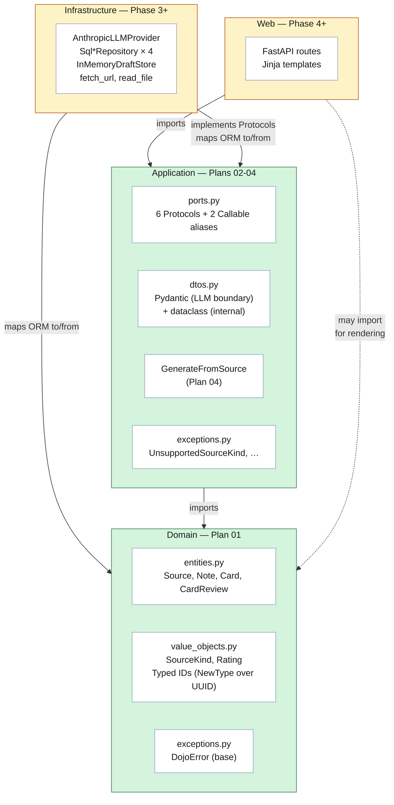
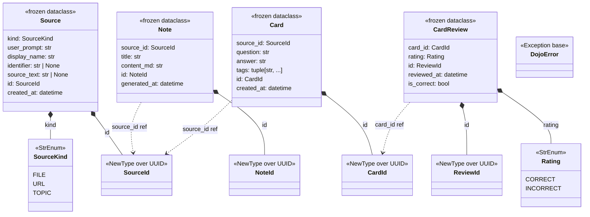
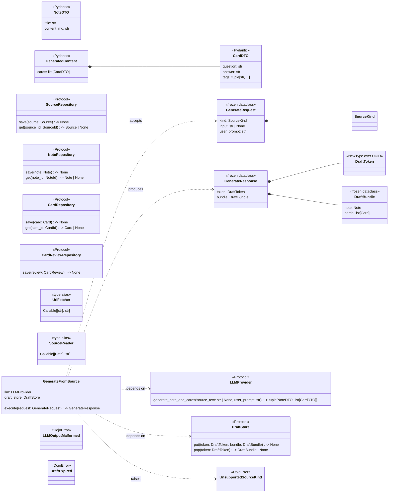
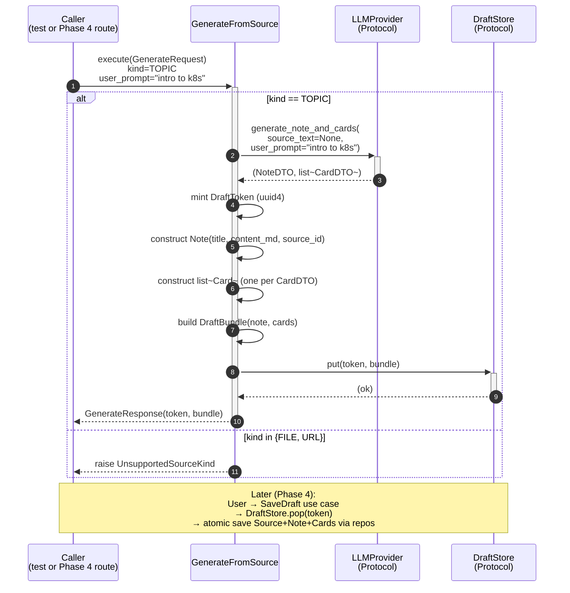

# Dojo v1 — Architecture Overview

**Last updated:** 2026-04-23
**Snapshot point:** Phase 2 (Plans 01–04 locked; Plan 05 pending)
**Scope:** Full v1 architecture. Locked layers rendered green; pending
layers (Phase 3 infrastructure, Phase 4+ web) rendered yellow.

This document is a **living v1 architecture overview**, updated as
each phase lands. It consolidates what spec §DOCS-01 will eventually
split into four canonical files under this folder (`layers.md`,
`domain-model.md`, `flows.md`, `ports-and-adapters.md`). Phase 7
refines + splits; until then, this single file carries the mental
model.

Five sections:

1. **Layered dependency direction** — which layer may import which
2. **Class diagram — domain layer** — entities + value objects
3. **Class diagram — application layer** — DTOs, ports, use case
4. **Implementor diagram** — fakes (now) + Phase 3 adapters (planned)
5. **Sequence diagram — GenerateFromSource TOPIC flow** — how the
   pieces collaborate on a single request

Plus a file-to-plan map and a Phase-2-out-of-scope section at the end.

---

## 1. Layered dependency direction

**Dependency rule:** arrows only flow inward. Domain imports nothing
outside stdlib. Application imports Domain + Pydantic (at the DTO
boundary). Infrastructure imports both and implements the Protocols.
Web imports Application (and reads Domain types for rendering).

**Plan 05 closes this** with `import-linter` contracts that fail
`make lint` if any of these rules are violated.

---

## 2. Class diagram — domain layer

The domain is **pure typed data**. No `__post_init__` validation,
no Pydantic, no ORM. Frozen dataclasses with typed IDs minted via
`default_factory`, tz-aware timestamps by construction.

**Reading this:**
- `*--` = composition (Source owns its SourceId, its SourceKind)
- `..>` = reference-only (Note holds a SourceId but doesn't own it —
  the Source is the owner of its identity)
- `<<StrEnum>>` values serialize natively as strings
  (`SourceKind.FILE == "file"`)
- `<<NewType over UUID>>` — zero runtime cost; `ty` catches passing
  a `SourceId` where a `NoteId` is expected

**What's intentionally NOT here:**
- No base entity class (dataclasses all the way down; no inheritance)
- No invariant methods (validation lives at boundary layers — see
  `02-01-SUMMARY.md` + STATE.md decision log)
- No domain services (none needed for Phase 2 scope)

---

## 3. Class diagram — application layer

The application layer declares **contracts** (Protocols + Callable
aliases) and **DTOs** (Pydantic for untrusted LLM I/O; stdlib dataclass
for internal shapes), plus the first **use case**. Structural subtyping
means implementors (fakes, future adapters) don't need to inherit from
the Protocols.

**Reading this:**
- Protocols are **not base classes** — implementors satisfy them
  structurally (duck typing verified at type-check time by `ty`)
- `GenerateFromSource` holds **Protocols**, not concrete adapters
  (DIP). Composition root in `app/main.py` (Phase 4+) will wire real
  adapters or fakes into this use case
- DTO layer is split by trust boundary:
  - **Pydantic DTOs** (`NoteDTO`, `CardDTO`, `GeneratedContent`)
    validate untrusted LLM tool-use output
  - **Internal dataclass DTOs** (`GenerateRequest`, `GenerateResponse`,
    `DraftBundle`) are shaped by our code — stdlib is enough

---

## 4. Implementors — fakes (now) and adapters (Phase 3)

Each Protocol has a fake today and will have a real adapter later.
Structural subtyping means neither inherits from the Protocol — they
just match the shape.

```mermaid
classDiagram
    direction TB

    %% Protocols (abbreviated)
    class LLMProvider {
        <<Protocol>>
    }
    class SourceRepository {
        <<Protocol>>
    }
    class NoteRepository {
        <<Protocol>>
    }
    class CardRepository {
        <<Protocol>>
    }
    class CardReviewRepository {
        <<Protocol>>
    }
    class DraftStore {
        <<Protocol>>
    }

    %% Fakes — Plan 03 (committed)
    class FakeLLMProvider {
        <<fake — tests/fakes>>
        returns: list
        raises: list
        calls: list
    }
    class FakeSourceRepository {
        <<fake>>
        saved: dict
    }
    class FakeNoteRepository {
        <<fake>>
        saved: dict
    }
    class FakeCardRepository {
        <<fake>>
        saved: dict
    }
    class FakeCardReviewRepository {
        <<fake>>
        log: list
    }
    class FakeDraftStore {
        <<fake>>
        puts: list
        force_expire(token: DraftToken) -> None
    }

    %% Real adapters — Phase 3 (planned)
    class AnthropicLLMProvider {
        <<Phase 3>>
    }
    class SqlSourceRepository {
        <<Phase 3>>
    }
    class SqlNoteRepository {
        <<Phase 3>>
    }
    class SqlCardRepository {
        <<Phase 3>>
    }
    class SqlCardReviewRepository {
        <<Phase 3>>
    }
    class InMemoryDraftStore {
        <<Phase 3>>
    }

    %% Structural subtype relationships (dashed — not inheritance)
    FakeLLMProvider ..|> LLMProvider : structural
    FakeSourceRepository ..|> SourceRepository : structural
    FakeNoteRepository ..|> NoteRepository : structural
    FakeCardRepository ..|> CardRepository : structural
    FakeCardReviewRepository ..|> CardReviewRepository : structural
    FakeDraftStore ..|> DraftStore : structural

    AnthropicLLMProvider ..|> LLMProvider : structural
    SqlSourceRepository ..|> SourceRepository : structural
    SqlNoteRepository ..|> NoteRepository : structural
    SqlCardRepository ..|> CardRepository : structural
    SqlCardReviewRepository ..|> CardReviewRepository : structural
    InMemoryDraftStore ..|> DraftStore : structural
```

**Reading this:**
- `..|>` = structural realization (the dashed arrow = duck typing).
  Neither fakes nor adapters inherit from the Protocol — they just
  satisfy its shape
- Both columns (fakes + adapters) satisfy the **same** Protocol. That's
  what makes the Plan 05 TEST-03 contract-test harness possible:
  one suite, parametrized over `[FakeLLMProvider, AnthropicLLMProvider]`
- When you add a new concrete adapter (Phase 3+), no Protocol changes
  are needed. That's the value of "add a class + one line in the
  composition root"

---

## 5. Sequence diagram — GenerateFromSource TOPIC flow

The one orchestration that exists today. Phase 4 adds FILE / URL flows
on top, and a separate Save use case that drains the draft store into
the repositories atomically.

**Reading this:**
- LLM is called with `source_text=None` for TOPIC (no external source
  snapshot; LLM draws on its own knowledge)
- `DraftToken` is minted by the use case, not passed in (server owns
  the key per PITFALL C10)
- `DraftStore.put` is the one-shot write; later pickup is `pop` which
  is atomic read-and-delete (no race with a concurrent save)
- FILE / URL branches raise before any expensive side effect —
  unsupported kinds fail fast

---

## 6. Where the pieces live (file map)

| Concept | File | Plan |
|---------|------|------|
| Domain entities | `app/domain/entities.py` | 01 |
| Value objects + IDs | `app/domain/value_objects.py` | 01 |
| Domain exception root | `app/domain/exceptions.py` | 01 |
| Protocols + Callables + DraftToken | `app/application/ports.py` | 02 |
| Pydantic + dataclass DTOs | `app/application/dtos.py` | 02 |
| App exceptions | `app/application/exceptions.py` | 02 |
| `GenerateFromSource` use case | `app/application/use_cases/generate_from_source.py` | 04 |
| Hand-written fakes | `tests/fakes/fake_*.py` | 03 |
| Unit tests per fake | `tests/unit/fakes/test_fake_*.py` | 03 |
| Unit tests per entity | `tests/unit/domain/test_*.py` | 01 |
| Unit tests per DTO / port / exception | `tests/unit/application/test_*.py` | 02 |
| Use-case orchestration tests | `tests/unit/application/test_generate_*.py` | 04 |
| Contract-test harness + import-linter | `tests/contract/`, `.importlinter` | 05 (pending) |

---

## 7. What Phase 2 does NOT deliver

Explicitly out of scope — these are Phase 3 (and later) concerns.
Knowing what the Protocols expect from them is important:

- **Real LLM calls** — `AnthropicLLMProvider` lands in Phase 3 with
  tenacity retries, Pydantic DTO validation, typed-exception wrapping.
- **Persistence** — `Sql*Repository` adapters + mappers, async-free
  sessionmaker, `expire_on_commit=False`. ORM-to-domain conversion at
  the mapper boundary.
- **Draft store concurrency** — `InMemoryDraftStore` with `asyncio.Lock`
  + lazy TTL eviction + 30-min expiry. Port contract documents the
  semantics; the adapter enforces them.
- **URL + file source reading** — `fetch_url` (httpx + trafilatura)
  and `read_file` (stdlib Path). Wired into the use case in Phase 4
  when FILE / URL branches light up.
- **Atomic save** — separate `SaveDraft` use case that pops from the
  draft store and writes Source + Note + Cards in one transaction.
  Phase 4.

---

*Last updated: 2026-04-23. Snapshot point: Phase 2 (Plans 01–04
locked; Plan 05 pending). Refresh per phase as new layers land.*

*Relationship to spec §DOCS-01: Phase 7 will split this overview into
four canonical files (`layers.md`, `domain-model.md`, `flows.md`,
`ports-and-adapters.md`). Until then, this single file carries the
mental model.*
