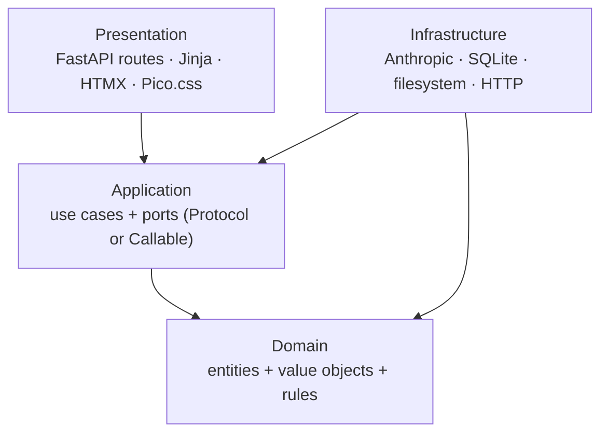
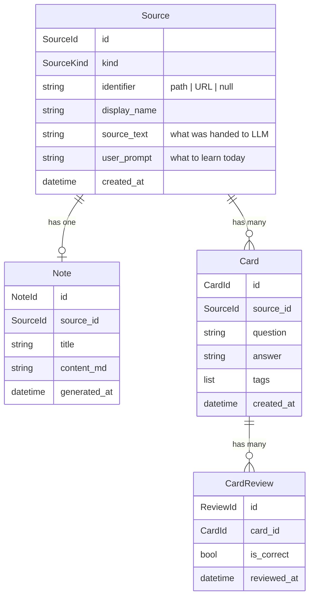
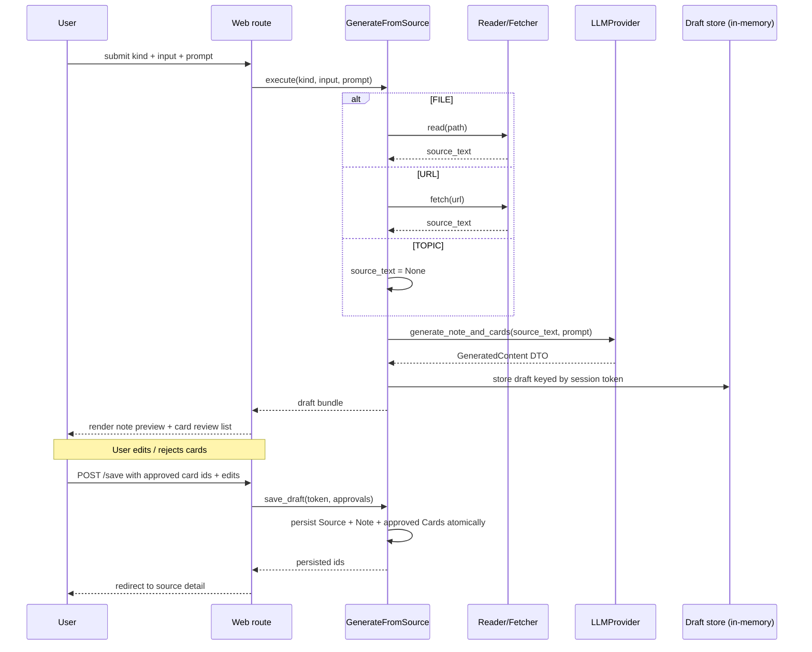
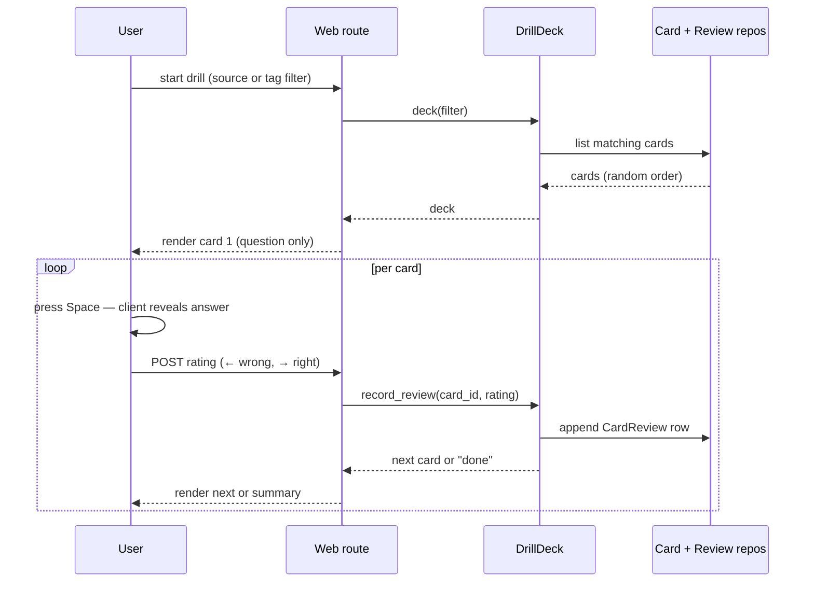
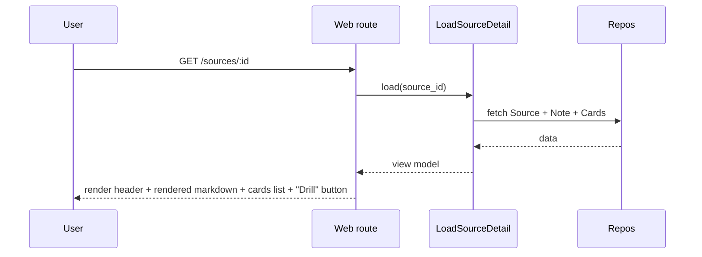

# Dojo — Interview Study App

**Design spec · 2026-04-18**

A local web app for tech interview prep. It turns source material
(Black Lodge wiki docs, URLs, raw text, or just a topic prompt) into
studyable notes and Q&A cards, then drills those cards with a
dating-app-style interaction (arrow keys or on-screen buttons).

Built as both a study tool and a build exercise: design decisions favor
interview-relevant patterns (DDD layering, DIP, FastAPI async + sync
DB via threadpool, structured LLM output) over shortcuts that would
ship faster but teach less.

---

## 1. Goals and non-goals

**Goals (MVP / Phase 1):**

- Generate notes + Q&A cards from three kinds of source: a single file (a
  Black Lodge wiki doc or raw pasted text), a URL, or a topic prompt with
  no source.
- Every generation is driven by a user prompt (_"basic intro to k8s,
  skip RBAC"_). The LLM may augment with its own knowledge beyond the
  source.
- Let the user review generated cards (edit, reject individually) before
  anything persists.
- Drill saved cards with arrow keys or on-screen buttons (Bumble/Tinder
  style): ← for wrong, → for right, Space to reveal, card slides off
  on commit.
- Render saved notes as readable markdown outside drill mode.
- Ship with one LLM provider (Anthropic) behind a `LLMProvider` port, so
  adding OpenAI / Ollama later is one concrete class and one composition
  root line.
- Test-driven, tests use hand-written fakes not mocks, output is pristine.
- CI on every push, pre-commit hooks locally, one `make check` command
  exercising all checks.

**Non-goals for MVP (deferred to later phases):**

- Folder-as-source with RAG (Phase 2 — deliberate extension, see §10).
- Mock-interview mode with typed-answer grading (Phase 2).
- Spaced repetition scheduling (Phase 3).
- Streaks, daily stats, heatmaps (Phase 3).
- OpenAI / Ollama providers (Phase 4, if earned).
- Multi-user, authentication, full-text search, Anki export, card
  versioning — not planned.

---

## 2. High-level architecture

Four layers, dependencies flow inward only. Each layer owns its own
types; no type definitions cross layer boundaries via imports.



- **Domain** is pure Python with zero external deps.
- **Application** defines ports (the abstractions outer layers must
  satisfy) and orchestrates use cases. The ports live here — this is
  where DIP is expressed.
- **Infrastructure** implements the ports using real adapters (Anthropic
  SDK, SQLAlchemy, filesystem, `httpx` + `trafilatura`).
- **Presentation** holds FastAPI routes and Jinja templates. Thin: parse
  request → call use case → render template.
- **Composition root** (`app/main.py`) is the only module that knows
  about all four layers; it wires concretes into use cases and hands
  them to the web routes.

Switching LLM provider = writing a new concrete class that satisfies
`LLMProvider`, swapping one line in the composition root.

---

## 3. Domain model

Four entities, two value objects. Deliberately small.



**Value objects:**

- `SourceKind` — enum: `FILE | URL | TOPIC` (MVP); extends with `FOLDER`
  in Phase 2.
- `Rating` — enum: `CORRECT | INCORRECT`. Binary for MVP; Phase 3 SRS
  will layer scheduling state on top of the review log without altering
  this enum.

**Field rationale:**

- `Source.identifier` — the external pointer (Black Lodge relative path,
  URL, or `None` for raw pasted text / topic prompt).
- `Source.source_text` — a snapshot of exactly what we gave the LLM.
  Populated for every kind so regeneration is reproducible (the Black
  Lodge doc might change later; we keep what we studied from).
- `Source.user_prompt` — the prompt the user typed to shape the
  generation. Stored for reproducibility and visible in the Read view.
- `Card.tags` — free-form list of strings. Default-copied from a
  source-level tag at generation but editable per card. Drill filters by
  tag. No separate `Topic` entity — a string is enough until it isn't.
- `CardReview` is append-only. We never denormalize `last_reviewed_at`
  on `Card`; compute it from the log when needed. This keeps the door
  open for SRS in Phase 3 (add scheduling columns on `Card`, backfill
  from `CardReview`, no migration pain).

**Regeneration policy:**

- Notes overwrite on regenerate. They are generated material, not
  user-authored; losing the prior version is fine.
- Cards append on regenerate. User prunes duplicates in the review step.
- No versioning of either in MVP. Schema supports adding it later.

**Layer ownership:**

- Domain entities are plain Python dataclasses. No ORM types, no
  Pydantic, no HTTP types.
- Application uses Pydantic DTOs for LLM I/O at its boundary to
  infrastructure. DTOs are distinct from domain entities; the
  application layer owns them.
- Infrastructure has its own SQLAlchemy models and its own mappers that
  convert ORM ↔ domain at the boundary.

---

## 4. Components

### 4.1 Package layout

```
dojo/
├── pyproject.toml           # uv + ruff (line 79) + ty + interrogate
├── Makefile
├── alembic.ini
├── .env.example
├── .pre-commit-config.yaml
├── .github/workflows/ci.yml
├── CLAUDE.md                # layout pointer for future Claude sessions
│
├── app/
│   ├── main.py              # composition root: wires infra into use cases
│   ├── settings.py          # pydantic-settings: reads ANTHROPIC_API_KEY
│   │
│   ├── domain/
│   │   ├── entities.py      # Source, Note, Card, CardReview
│   │   ├── value_objects.py # SourceKind, Rating, typed IDs
│   │   └── exceptions.py
│   │
│   ├── application/
│   │   ├── ports.py         # LLMProvider (Protocol), repos (Protocols),
│   │   │                    # UrlFetcher + SourceReader (Callable aliases)
│   │   ├── dtos.py          # Pydantic DTOs for LLM I/O
│   │   ├── generate_from_source.py
│   │   ├── review_cards.py
│   │   ├── drill_cards.py
│   │   ├── load_source_detail.py
│   │   └── exceptions.py
│   │
│   ├── infrastructure/
│   │   ├── db/
│   │   │   ├── models.py    # SQLAlchemy 2.0 ORM (sync)
│   │   │   ├── mappers.py   # ORM ↔ domain conversion
│   │   │   └── session.py
│   │   ├── repositories/
│   │   │   ├── source_repository.py
│   │   │   ├── note_repository.py
│   │   │   ├── card_repository.py
│   │   │   └── card_review_repository.py
│   │   ├── llm/
│   │   │   ├── anthropic_provider.py
│   │   │   └── prompts.py   # prompt templates (Jinja, versioned)
│   │   └── sources/
│   │       ├── file_reader.py   # reads any path, incl. Black Lodge wiki docs
│   │       └── url_fetcher.py   # httpx + trafilatura
│   │
│   └── web/
│       ├── routes/
│       │   ├── home.py
│       │   ├── sources.py   # generate, list, detail
│       │   ├── cards.py     # review, edit, approve, delete
│       │   └── drill.py
│       ├── templates/
│       │   ├── base.html
│       │   ├── components/
│       │   ├── sources/
│       │   ├── cards/
│       │   └── drill/
│       ├── static/
│       │   ├── htmx.min.js
│       │   └── pico.min.css
│       └── deps.py          # FastAPI Depends() for use-case injection
│
├── migrations/              # Alembic migrations (sync)
│   ├── env.py
│   └── versions/
│
├── docs/
│   ├── superpowers/specs/   # this file
│   └── architecture/
│       ├── README.md        # index
│       ├── layers.md        # Mermaid: 4-layer diagram + DIP
│       ├── domain-model.md  # Mermaid: ER
│       ├── flows.md         # Mermaid: Generate / Drill / Read sequences
│       └── ports-and-adapters.md  # port → adapter table
│
└── tests/
    ├── unit/                # domain + application with fake ports
    ├── integration/         # real SQLite tmp + respx + real FS
    └── e2e/                 # Playwright, full HTTP, fake LLM
```

Every Python file starts with two `# ABOUTME:` lines per project
convention. File sizes kept ≤100 lines per the python-project-setup
wiki (split if >150).

### 4.2 Library picks

| Concern | Library | Rationale |
| --- | --- | --- |
| Web framework | FastAPI (async) | Modern async-native Python web framework; ubiquitous in backend interviews |
| Templating | Jinja2 + HTMX | Server-rendered; HTMX removes JS framework overhead |
| CSS | Pico.css | Classless, zero-build, decent defaults |
| DB | SQLAlchemy 2.0 (sync) + SQLite | Single-user local-first workload — async buys nothing over threadpool; reversed from async in Phase 1 review |
| Migrations | Alembic (sync) | Stock template; pairs with sync SQLAlchemy |
| Config | pydantic-settings | Typed env loading |
| LLM SDK | `anthropic` | Structured output via tool use |
| Markdown render | `markdown-it-py` | Note rendering in Read view |
| URL extraction | `trafilatura` | Strips nav/ads, extracts main content |
| HTTP client | `httpx` (async) | Native async, paired with trafilatura |
| Dev tooling | `uv`, `ruff` (79-char), `ty` (astral), `interrogate` (100%) | Per python-project-setup wiki |
| Test | `pytest`, `pytest-asyncio` (route tests), `respx` | Async tests at the FastAPI route layer; sync at the DB layer |
| E2E | `playwright` | Browser-driven for drill flows |
| Pre-commit | `pre-commit` | Runs the same checks as `make check` |

### 4.3 Ports and adapters

Stateless one-op ports are typed `Callable` aliases. Stateful or
multi-method ports are `typing.Protocol`. The wiki "prefer Protocol over
ABC" rule applies after this first cut, not before it (see global
CLAUDE.md, Designing software section).

| Port | Shape | Reason | MVP adapter |
| --- | --- | --- | --- |
| `LLMProvider` | Protocol | Has state (Anthropic client, config); will grow (Phase 2 adds mock-interview methods) | `AnthropicLLMProvider` |
| `SourceRepository` | Protocol | Multiple methods: save, by_id, list, delete | `SqlSourceRepository` |
| `NoteRepository` | Protocol | Multiple methods | `SqlNoteRepository` |
| `CardRepository` | Protocol | Multiple methods | `SqlCardRepository` |
| `CardReviewRepository` | Protocol | Multiple methods | `SqlCardReviewRepository` |
| `UrlFetcher` | `Callable[[str], str]` | One-shot, stateless | `fetch_url` function using httpx + trafilatura |
| `SourceReader` | `Callable[[Path], str]` | One-shot, stateless | `read_file` function |

---

## 5. Data flows

### 5.1 Generate (FILE / URL / TOPIC)



**Draft store**: in-memory dict keyed by short-lived session token (UUID,
30-minute TTL). Backend restart loses drafts — acceptable for a
single-user local app. Avoids orphan DB rows if the user closes the tab
mid-review.

**Atomic save**: Source + Note + Cards in one transaction. If any
fails, all roll back.

### 5.2 Drill



Dating-app-style interaction (Bumble / Tinder on web):

- **Space** → reveal the answer.
- **`→`** (right arrow) or click the on-screen ✓ button → correct; card
  animates sliding off to the right.
- **`←`** (left arrow) or click the on-screen ✗ button → incorrect;
  card animates sliding off to the left.
- No mouse-drag gesture in MVP — the swipe _feel_ lives in the commit
  animation, not a drag interaction. Real mouse-drag is deferred to
  Phase 3 polish if it turns out to matter.

Summary at end of deck shows X / Y correct and session duration.

### 5.3 Read



Markdown rendered via `markdown-it-py` into sanitized HTML.

---

## 6. Error handling

Two external boundaries fail: **LLM calls** and **network fetches**.
Everything inside is internal and raises domain exceptions.

### 6.1 LLM failures

- **Rate limit (429) / transient network error** → exponential backoff,
  3 retries max. If all fail, surface to user with a retry button.
- **Structured output parse failure** (malformed JSON / wrong schema) →
  one retry with a stricter prompt. If still bad, raise
  `LLMOutputMalformed` and show the raw response in a collapsible block
  so the user can see what happened.
- **Empty/refused content** (safety filter or empty response) → raise
  `LLMEmptyResponse`, surface the raw response. No silent swallowing.
- **Token limit exceeded** → adapter catches, raises
  `LLMContextTooLarge` with guidance: "source too long, shorten it."

### 6.2 Network failures (URL kind)

- Timeout / connection error → `SourceFetchFailed("couldn't fetch URL")`.
- Non-2xx HTTP status → `SourceFetchFailed("URL returned {status}")`.
- Content-type not HTML → `SourceNotArticle`.

### 6.3 Filesystem failures (FILE kind)

- Path missing → `SourceNotFound`.
- Permission denied → `SourceUnreadable`.

### 6.4 Rules

- All exceptions defined in `app/domain/exceptions.py` and
  `app/application/exceptions.py` per the python-project-setup wiki.
- Infrastructure **wraps** third-party errors
  (`anthropic.RateLimitError`, `httpx.TimeoutException`,
  `FileNotFoundError`) into our own types — no third-party error types
  leak into the application layer.
- FastAPI exception handlers at the web layer translate domain
  exceptions into HTTP responses with readable messages.
- No silent fallbacks, no "try another provider" heroics. Fail loud.
- Per the testing strategy in §7, every expected-error path gets a test
  that asserts the error message and type.

---

## 7. Testing strategy

TDD per the global CLAUDE.md. Tests written first, tests use real logic
with hand-written fakes at DIP boundaries (never `Mock()` for
behavior-testing), test output pristine.

### 7.1 Unit tests (`tests/unit/`)

- **Domain** — entity invariants, value-object validation, pure logic.
  Zero I/O. Fastest tier.
- **Application** — each use case tested by wiring **hand-written
  fakes**: `FakeLLMProvider`, `FakeCardRepository`, etc. Fakes
  implement the Protocol/Callable and record calls in assertable form
  (`fake.saved_cards == [...]`). No `Mock()`, no `assert_called_with`.
- **Infrastructure mappers** — ORM↔domain conversion round-trips,
  checked without touching the DB.

### 7.2 Integration tests (`tests/integration/`)

- **Repositories** — real SQLite in a tmp file fixture (sync session
  via SAVEPOINT rollback). Each test applies migrations, runs, cleans
  up. Verifies SQL actually works and mappers round-trip.
- **File reader** — real filesystem, tmp paths.
- **URL fetcher** — real `httpx` + `trafilatura` logic against
  `respx`-stubbed HTTP. Deterministic but exercises the real parsing.
- **LLM provider** — opt-in via env var `RUN_LLM_TESTS=1`. Hits real
  Anthropic with a minimal prompt to verify response shape. Skipped by
  default; run manually when touching the adapter.

### 7.3 End-to-end tests (`tests/e2e/`)

- Playwright drives the full app through a browser. One happy path per
  flow: Generate → Review → Save → Drill → Read. Uses a
  `FakeLLMProvider` injected via env var (`DOJO_LLM=fake`) so E2E runs
  don't burn API tokens.

### 7.4 Coverage

- Target: >90% per global rule.
- Quality first: meaningful tests that would catch real bugs, not
  superficial line-coverage fillers.

---

## 8. Tooling

### 8.1 Makefile targets

```
make install    # uv sync + pre-commit install
make format     # ruff format
make lint       # ruff check
make typecheck  # ty
make docstrings # interrogate (100%)
make test       # pytest
make check      # format + lint + typecheck + docstrings + test
make run        # uvicorn dev server with reload
make migrate    # alembic upgrade head
```

No `db-reset` target — deliberate. If a fresh DB is needed, `rm dojo.db
&& make migrate` is a manual two-second op, and a Makefile target there
is a foot-gun exactly where the DB-safety instinct says there shouldn't
be one.

### 8.2 Pre-commit

`.pre-commit-config.yaml` runs ruff format, ruff check, ty, interrogate,
and pytest. Same as `make check` — CI, pre-commit, and local all exercise
the same command.

### 8.3 CI (GitHub Actions)

`.github/workflows/ci.yml` runs on push and PR:

1. Checkout
2. Set up Python 3.12 and uv
3. `make install`
4. `make check`

Single job; no matrix. Python 3.12 pinned for reproducibility.

### 8.4 Project `CLAUDE.md`

Repo root `CLAUDE.md` explains:

- Project purpose in one paragraph
- Package layout pointer (point at `docs/architecture/` and the `app/`
  tree)
- How to run (`make install && make run`)
- Where the DIP boundaries are (point at `app/application/ports.py`)
- The Protocol-vs-function clarifier, project-local copy
- Test strategy pointer

Kept terse — under 150 lines — so Claude reads it efficiently.

### 8.5 Wiki updates (proposed, not yet written)

During implementation, propose additions to the Black Lodge
`python-project-setup.md`:

- A "Makefile conventions" section codifying the standard targets so
  future projects start from the same shape.
- A "CI/CD" section codifying the pattern of GitHub Actions delegating
  to Makefile targets (keeps CI logic reproducible locally via
  `make check`).

Both are evergreen patterns, not project-specific. Draft first, review,
then write.

---

## 9. Decisions log

Non-obvious decisions made during brainstorming, captured so future
sessions don't have to re-litigate.

| Decision | Rationale |
| --- | --- |
| Name: Dojo | Training-ground metaphor; short; non-Twin-Peaks so it doesn't overlap with Black Lodge knowledge base |
| Stack: Python + FastAPI + HTMX + Pico | Python is ubiquitous in backend/infrastructure/AI interviews; exercises real service patterns without drowning in frontend work |
| Sync SQLAlchemy (reversed from async) | Async-throughout was overkill for a single-user SQLite app; async remains at the web tier (FastAPI, httpx, LLM client) — sufficient async surface for interview-relevance without the threadpool tax |
| Pico.css | Zero-build; UI is not a focus for MVP |
| API key via env + `.env` via pydantic-settings | Industry-standard, keeps secrets out of domain/app layers; swap to OS keychain later if desired |
| One LLM provider in MVP, port abstraction built in | Abstractions built without a second implementation often leak; design carefully but ship one concrete |
| Drafts held in memory, DB writes only on user save | Avoids orphan rows; acceptable to lose drafts on backend restart for single-user local |
| Notes overwrite, cards append on regenerate | Notes are generated material — safe to lose; cards carry review history — safe to keep |
| No SRS in MVP | Needs scheduler + due queue + changed drill UX; add later by extending Card columns and reading from CardReview log |
| Dating-app-style drill | Space reveals, ← wrong, → right (or click on-screen ✗/✓ buttons). Card slides off on commit for the swipe feel. No mouse-drag in MVP — the pattern Bumble and Tinder use on desktop |
| Stateless ports = Callable alias, stateful/multi-method = Protocol | Protocol-vs-function is a separate decision from Protocol-vs-ABC; see global CLAUDE.md |
| Fakes, not mocks | Behavior-testing via hand-written fakes that implement the port — assertable state, not call patterns |
| No `make db-reset` | Foot-gun at the exact spot the DB-safety instinct says avoid; manual `rm dojo.db && make migrate` is sufficient |
| DB-safety rule: Claude confirms before destructive ops during dev chats | Not a product-UI rule; about Claude's actions during implementation |

---

## 10. Phase roadmap

### Phase 1 — MVP (this spec)

Everything above. Definition of done:

- `make install && make run` starts the app at `http://localhost:8000`.
- Generate a card set from a Black Lodge wiki file, a URL, and a topic
  prompt.
- Review, edit, reject individual cards; save what's approved.
- Drill saved cards via arrow keys or on-screen buttons, with card
  slide-off animation on commit.
- Read saved notes rendered from markdown.
- `make check` passes: ruff, ty, interrogate (100%), pytest (>90%
  coverage).
- Pre-commit hook runs `make check`.
- GitHub Actions CI runs `make check` on push and PR.
- Four Mermaid diagrams exist in `docs/architecture/` and render in
  GitHub.
- Repo root `CLAUDE.md` describes the layout.

### Phase 2 — RAG + mock interview

- New `SourceKind.FOLDER`: point at a Black Lodge folder (e.g.
  `wiki/`), index it, retrieve on generation.
- New ports: `Retriever` (Protocol, multi-method), `EmbeddingProvider`
  (Protocol, stateful).
- Concrete: local `sentence-transformers` model
  (`BAAI/bge-small-en-v1.5` or similar, CPU, no extra API key); SQLite
  + `sqlite-vec` for the vector store.
- Indexer walks the folder, chunks markdown, embeds, persists.
  Re-indexes on mtime change.
- `GenerateFromSource` gains a FOLDER branch that retrieves top-k
  chunks before calling the LLM.
- Small retrieval-quality eval harness: hand-labeled (query, expected
  doc) pairs, measure hit-rate. Interview-relevant exercise.
- Mock interview mode:
  - Paste a job ad → LLM generates a tailored interview plan (list of
    topics / likely questions).
  - Drill mode C: user types their answer, LLM grades semantically,
    returns brief feedback (correct / partial / wrong). Uses the same
    `LLMProvider` port.

### Phase 3 — Stickiness

- SRS scheduling: add columns to `Card` (`ease_factor`, `interval`,
  `next_review_at`, `repetitions`). Backfill from `CardReview` log.
  SM-2 or FSRS.
- Drill UX: "cards due today" replaces "pick deck."
- Daily streaks, heatmap calendar, "weak cards" indicator — all
  computable from `CardReview`.

### Phase 4+ — Optional

- Second LLM provider (OpenAI or Ollama) — exercises the port, validates
  the abstraction didn't leak.
- SQLite FTS5 search across notes and cards.
- Anki export.

---

## 11. Intentional exclusions

Listed so they don't reappear as "did we forget?" later.

- **No user accounts / auth.** Single user, local.
- **No server deployment.** Runs on localhost only.
- **No card versioning in MVP.** Addable later; schema is compatible.
- **No multi-provider LLM in MVP.** Port is there; only Anthropic
  implemented.
- **No local LLM in MVP.** Paid cloud API; local model is Phase 4.
- **No real-time updates / websockets.** HTMX polling or form posts are
  sufficient.
- **No structured test data fixtures beyond what each test needs.** No
  faker, no factories. Each test builds its own minimal data.
- **No observability beyond standard Python logging.** Production web
  services typically need metrics + traces (Prometheus / OTel);
  Dojo is a local single-user study app and doesn't.

---

## 12. Open questions

None at spec-writing time. All decisions locked above. If implementation
surfaces new forks, they'll be raised with the user before being decided.
